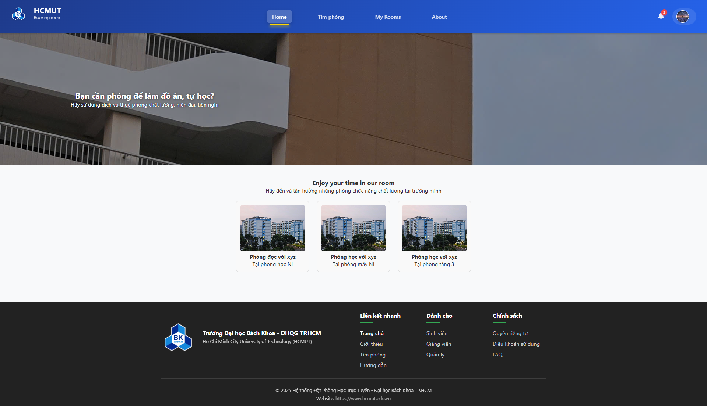
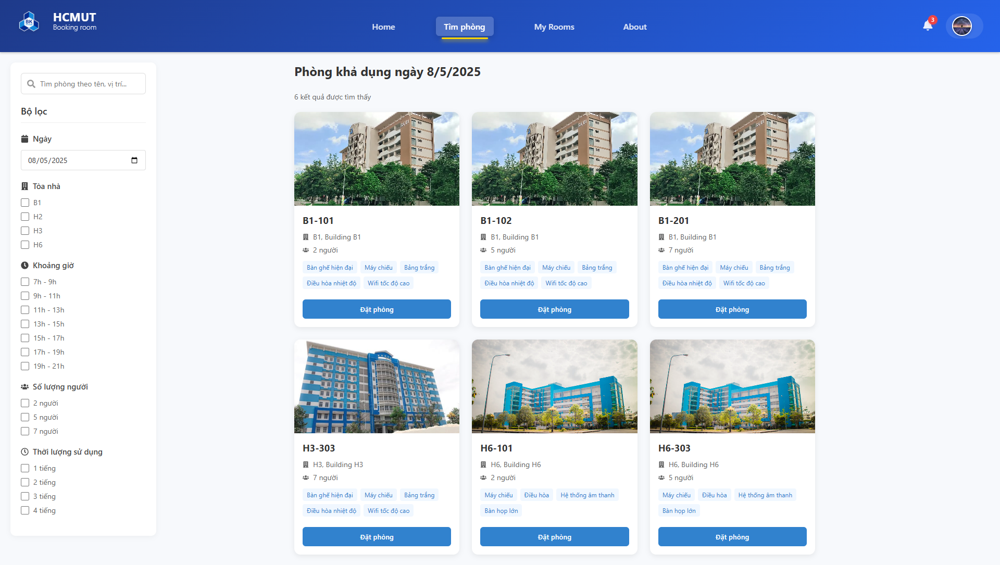
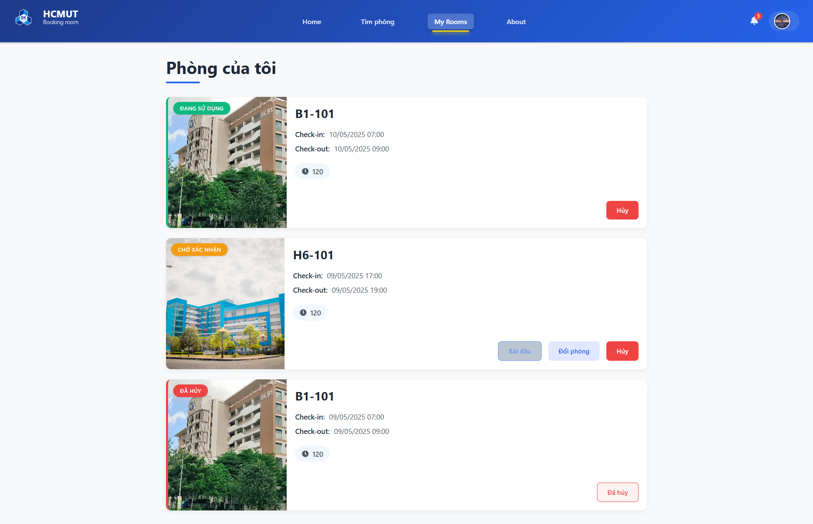
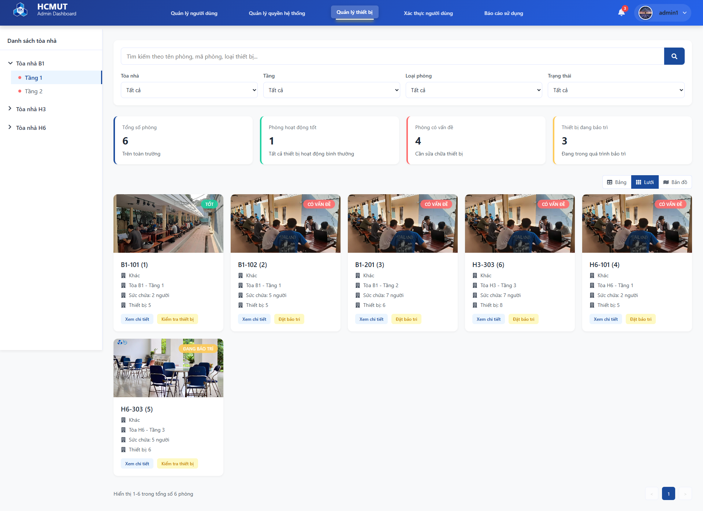
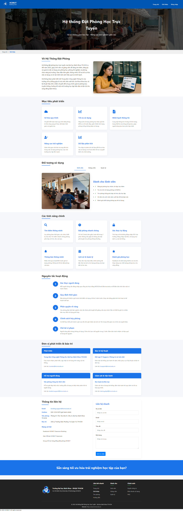

# 🏫 HCMUT Room Booking System

<div align="center">


[](LICENSE)
[](https://nodejs.org/)
[](https://reactjs.org/)
[](https://expressjs.com/)

**A comprehensive room management solution for Ho Chi Minh City University of Technology**

</div>

## 📖 Overview

The **HCMUT Room Booking System** is a modern web application designed to streamline the process of finding, reserving, and managing rooms across the HCMUT campus. Built with performance and user experience in mind, this system serves students, faculty members, administrators, and technical staff with tailored features to meet their specific needs.

<div align="center">
  


</div>

## ✨ Key Features

### 👨‍🎓 For Students
- **Smart Room Search** - Find available rooms based on capacity, location, and equipment
- **Easy Booking** - Schedule study sessions, group meetings, or project work with a few clicks
- **Visual Room Details** - View high-quality images and comprehensive information about each room
- **Booking Management** - Check-in, check-out, reschedule, or cancel bookings as needed
- **Real-time Notifications** - Stay informed about booking confirmations, reminders, and changes

### 👨‍💼 For Administrators
- **User Management** - Verify profiles, assign roles, and manage access permissions
- **Resource Administration** - Add, edit, or remove rooms and facilities from the system
- **Equipment Oversight** - Track and manage room equipment and technology
- **Booking Workflow** - Review and approve booking requests with customizable rules
- **Analytics Dashboard** - Generate usage reports and gain insights into facility utilization

### 👨‍🔧 For Technical Staff
- **Equipment Monitoring** - Track device status and health in real-time
- **Maintenance Planning** - Schedule regular or emergency maintenance for rooms and equipment
- **Inventory Control** - Manage equipment inventory and track assets efficiently

## 🔧 Technology Stack

| Component | Technology |
|-----------|------------|
| **Frontend** | React.js, Redux, Material UI |
| **Backend** | Node.js, Express.js |
| **Database** | MySQL, Redis |
| **Authentication** | JWT, OAuth 2.0 |
| **API Architecture** | RESTful |
| **Deployment** | Docker, Nginx |

## 🏗️ System Architecture

```
┌─────────────────┐      ┌─────────────────┐      ┌─────────────────┐
│                 │      │                 │      │                 │
│  React Frontend │◄────►│   Express API   │◄────►│  MySQL Database │
│                 │      │                 │      │                 │
└─────────────────┘      └────────┬────────┘      └─────────────────┘
                                  │
                         ┌────────▼────────┐
                         │                 │
                         │  Redis Cache    │
                         │                 │
                         └─────────────────┘
```

## 🚀 Getting Started

### Prerequisites
- Node.js (v16+)
- npm or yarn
- MySQL (v8+)
- Redis (v6+)

### Installation

1. **Clone the repository**
   ```bash
   git clone https://github.com/hcmut/room-booking-system.git
   cd room-booking-system
   ```

2. **Install frontend dependencies**
   ```bash
   cd src
   npm install
   ```

3. **Install backend dependencies**
   ```bash
   cd ../backend
   npm install
   ```

4. **Configure environment variables**
   ```bash
   cp .env.example .env
   # Edit .env with your database credentials and other settings
   ```

5. **Set up the database**
   ```bash
   npm run db:setup
   ```

6. **Start the development servers**
   ```bash
   # Start backend server
   npm run server
   
   # In another terminal, start frontend
   cd ../src
   npm start
   ```

7. **Access the application**
   - Frontend: http://localhost:3000
   - API: http://localhost:5000

## 📂 Project Structure

```
room-booking-system/
├── src/                  # React frontend
│   ├── components/       # Reusable UI components
│   ├── pages/            # Application pages
│   ├── services/         # API service connections
│   ├── utils/            # Utility functions
│   └── App.js            # Main application component
├── backend/              # Node.js backend
│   ├── controllers/      # Request handlers
│   ├── models/           # Database models
│   ├── routes/           # API routes
│   ├── middleware/       # Custom middleware
│   ├── SQL/              # Database migrations and seeds
│   └── server.js         # Server entry point
├── public/               # Static assets
└── docs/                 # Documentation
```

## 📱 Screenshots

<div align="center">
<table>
  <tr>
    <td></td>
    <td></td>
  </tr>
  <tr>
    <td></td>
    <td></td>
  </tr>
  <tr>
    <td></td>
  </tr>
</table>
</div>

## 📝 API Documentation

API documentation is available at `/api/docs` when running the development server, or you can view the [online API reference](https://example.com/api-docs).

## 🧪 Testing

```bash
# Run frontend tests
cd src
npm test

# Run backend tests
cd ../backend
npm test
```

## 🤝 Contributing

We welcome contributions from HCMUT students and faculty! Please follow these steps:

1. Fork the repository
2. Create a feature branch (`git checkout -b feature/amazing-feature`)
3. Make your changes
4. Commit your changes (`git commit -m 'Add some amazing feature'`)
5. Push to the branch (`git push origin feature/amazing-feature`)
6. Open a Pull Request

## 👥 Project Team

This project is developed by students in the Software Engineering course at HCMUT for the 2024-2025 academic year:

- **Project Lead**: [Student Name]
- **Frontend Developers**: [Student Names]
- **Backend Developers**: [Student Names]
- **UI/UX Designers**: [Student Names]
- **QA Engineers**: [Student Names]

## 📜 License

All rights reserved. This project is developed for educational purposes at Ho Chi Minh City University of Technology.

## 📞 Support

For support, please contact the development team at [email@hcmut.edu.vn](mailto:email@hcmut.edu.vn) or open an issue on GitHub.

---

<div align="center">
  <sub>Built with ❤️ at Ho Chi Minh City University of Technology</sub>
</div>
